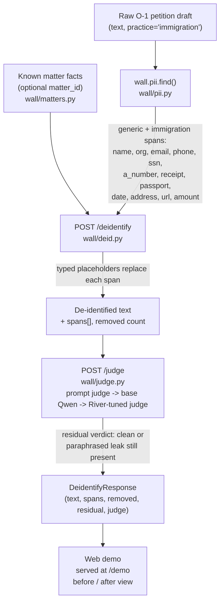

# Architecture

Five layers keep a client's facts inside their matter, and one scrubbed loop lets *procedures*
compound across matters. See [`docs/PRD.md`](PRD.md) ("Architecture") for the product framing and
[`docs/CONTRACT.md`](CONTRACT.md) for the endpoint contract and branch ownership behind every file
linked below.

## Request path

A request enters through a matter-scoped GBrain client. The agent can recall only its own matter;
every draft it produces passes the output guard before a human sees it; only a scrubbed,
judge-verified trace is ever eligible to become a firm-wide skill.

```mermaid
flowchart TD
    Agent["Matter agent\n(agent/)"] -->|scoped OAuth client, read-only| Client["walls/client.py\nwalls/attack.py"]
    Client -->|MCP, source_id = own matter only| GBrain[("GBrain\none isolated source per matter")]
    GBrain -->|matter facts + documents| Agent
    Agent -->|draft| Check["POST /check\nwall/guard.py\nregex_fingerprint_hits + carryover_hits"]
    Check -->|CheckResponse: verdict, hits[]| Human(["Attorney reviews\nflags never auto-rewrite"])
    Human -->|approved session trace| Scrub["POST /scrub\nwall/scrub.py\npolicy-driven: fixtures/policy.json"]
    Scrub -->|scrubbed text, removed count| Memorable[("Memorable\nmemorable/ingest.sh")]
    Memorable -->|promoted skill| Agent
```

| Component | File on `main` |
|---|---|
| Matter agent (scoped recall, drafts a letter) | `agent/` |
| Scoped GBrain client, one per matter, read-only | `walls/client.py` |
| Live cross-matter attack (`permission_denied` check) | `walls/attack.py`, `walls/README.md` |
| Matter fixtures (facts, corpus, practice tag) | `wall/matters.py`, `fixtures/matters/` |
| `/check` — regex fingerprint + carryover 6-gram detectors | `wall/guard.py` |
| `/scrub` — policy-driven scrubber (never LLM-paraphrases) | `wall/scrub.py`, `fixtures/policy.json` |
| Memorable ingest of the scrubbed trace | `memorable/ingest.sh`, `memorable/trace_scrubbed.json` |
| Shared contract (request/response shapes) | `wall/contract.py` |
| HTTP surface wiring every route above | `wall/server.py` |

## De-identification pipeline (O-1 demo)

The O-1 path runs the same guard-then-scrub idea one layer earlier: it strips identifiers out of a
single draft *before* a human ever has to decide whether it may compound.



| Component | File on `main` |
|---|---|
| Generic + immigration PII detection (12 kinds) | `wall/pii.py`, `tests/test_pii.py` |
| De-identify endpoint: replace spans, verify residual | `wall/deid.py` |
| Synthetic O-1 beneficiaries (matter.json + petition docs) | `fixtures/matters/o1-achterberg/`, `fixtures/matters/o1-umeh/`, `fixtures/matters/o1-duarte/` |
| Immigration practice policy (may/never compound) | `fixtures/policy.json` → `"immigration"` |
| Judge: prompt frontier, base Qwen, River-tuned Qwen (`/judge` HTTP endpoint lands with B2's merge; the three-way numbers in `results/results.json` are already recorded by B2's eval harness) | `wall/judge.py`, `river/` |
| O-1-specific eval set (self-written, never the headline) | `evals/` (set name `o1_demo` in `results/results.json`) |
| Web demo: de-identify workspace, wall + compounding pages | `demo/`, `wall/walldemo.py`, `wall/compound.py` — ownership in `docs/CONTRACT.md` § "Web demo" |
| Scoreboard (reads `results/results.json` only) | `scoreboard/`, `wall/results.py` |

The contract for every shape above — `CheckRequest`/`CheckResponse`, `ScrubRequest`/`ScrubResponse`,
`JudgeRequest`/`JudgeResponse`, `DeidentifyRequest`/`DeidentifyResponse`, `EvalResult` — is frozen in
[`wall/contract.py`](../wall/contract.py); no lane changes it without the coordinator.

## Two rules that shape both diagrams

- **The guard subtracts the current matter's own facts first.** A name or amount that also belongs
  to the current matter is never flagged, even if another matter happens to share it — see
  `regex_fingerprint_hits` in `wall/guard.py`.
- **Nothing here auto-paraphrases to beat a detector.** `/check` and `/deidentify` only flag or
  replace; a human decides what happens next. That's a product rule, not a technical limitation —
  see `docs/PRD.md` ("Product principles").
