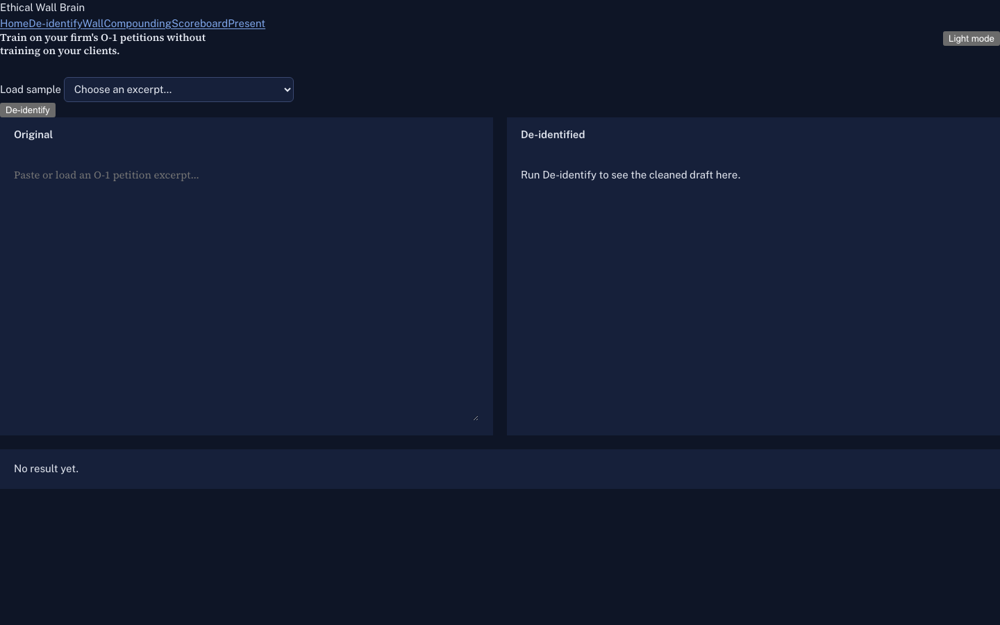
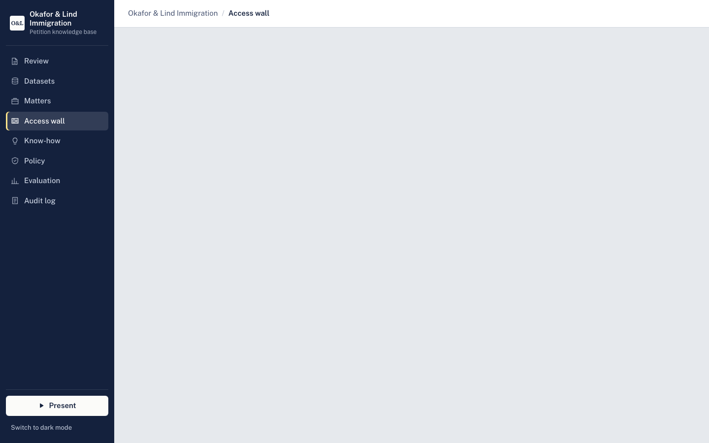
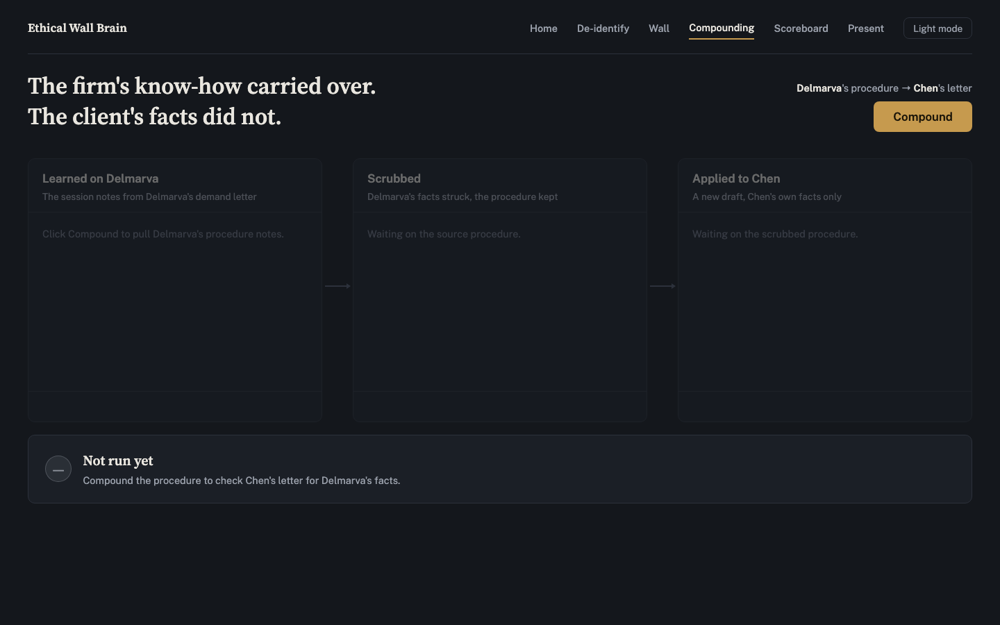
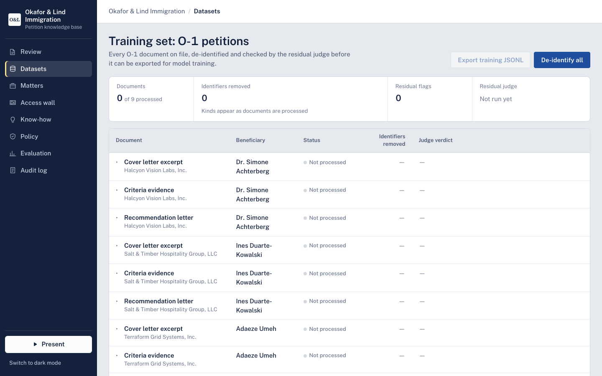
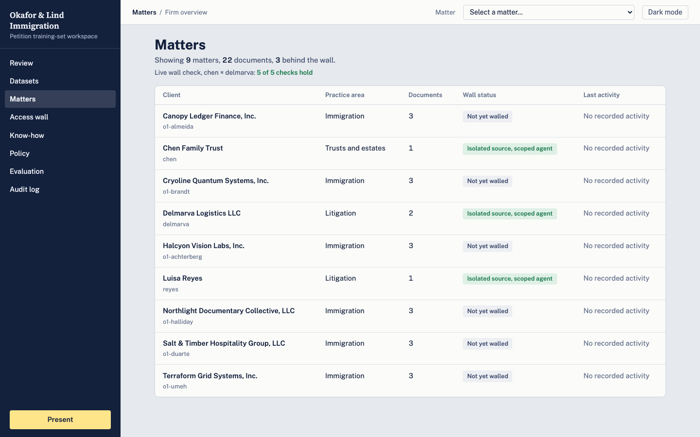
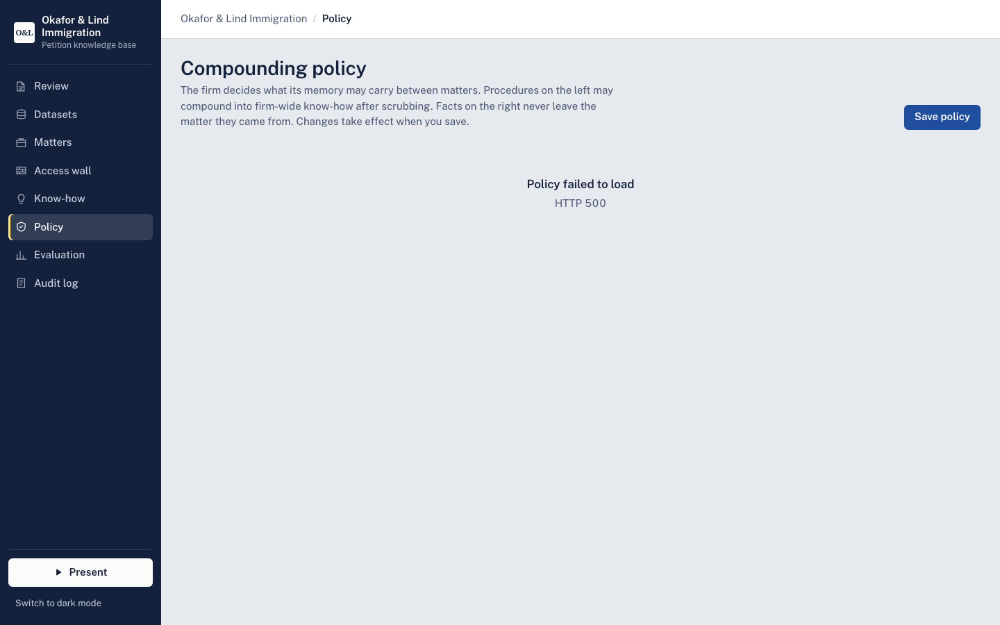
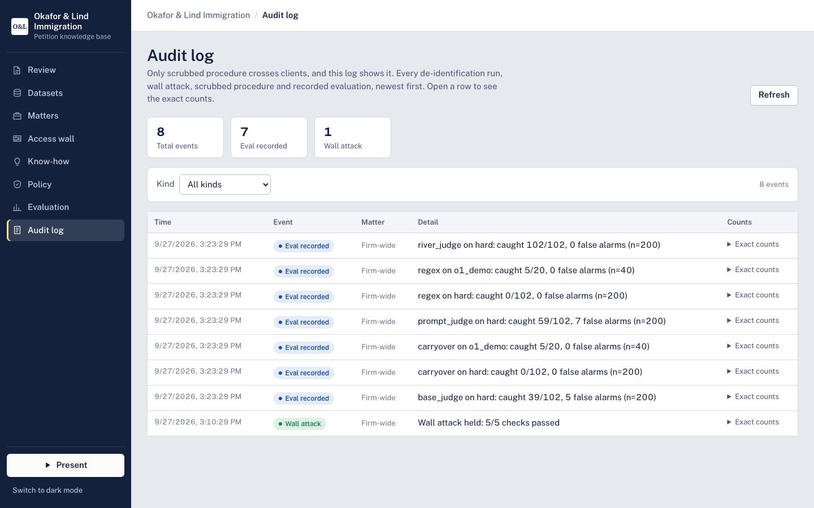
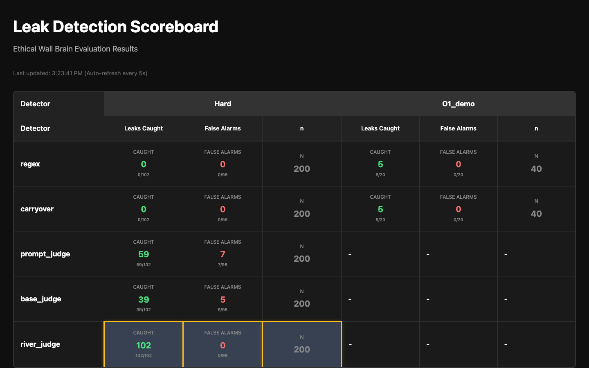
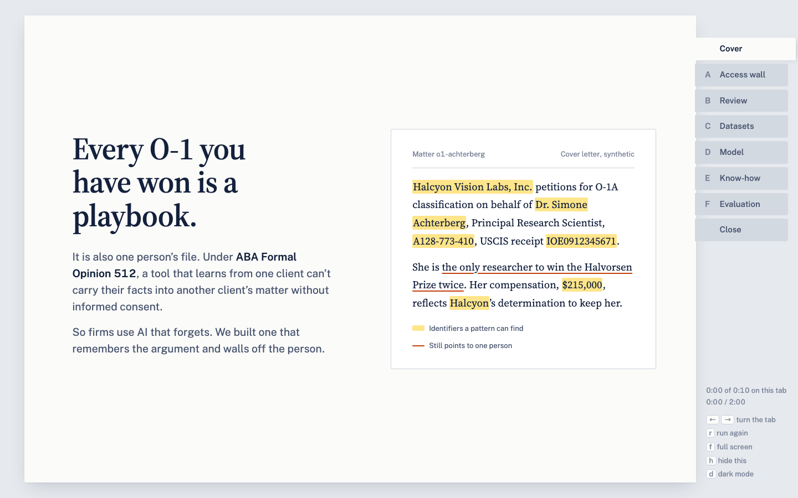

# Ethical Wall Brain — v0.1-demo

Release notes for tag `v0.1-demo` of `github.com/d-q222/the-wall`.
Numbers below were read from `results/results.json` (shared results file,
gitignored) at **16:00 PDT, Sept 27** and refreshed at the 16:05 merge.
The coordinator publishes this release.

## What it is

Ethical Wall Brain is agent memory for **small immigration firms** that
compounds the firm's know-how while walling off each client's facts.

The pitch: today, firms stay safe by using AI that forgets. We let it
remember the firm's know-how without remembering one client inside
another's work. A firm can **train on past O-1 petitions without training
on clients** — de-identified procedures (how a strong O-1 case is built)
compound across matters, while names, employers, salaries, award years,
and strategy never cross a matter boundary.

## What's in the demo

One product at `http://localhost:8788/demo/`, plus the scoreboard.
Every screen, one line:

- Review (`/demo/`) — the de-identify workspace: open an O-1 exhibit, run the pipeline, inspect Original / Redline / Clean side by side.
- Access wall (`/demo/wall.html`) — live wall attack across two matter rooms; five real requests to GBrain, five denials.
- Know-how (`/demo/compound.html`) — a procedure learned on matter A improves matter B's draft, with zero A facts carried over.
- Datasets (`/demo/datasets.html`) — per-document identifier-removal ledger feeding the training set.
- Matters (`/demo/matters.html`) — firm overview: every matter, its practice tag, and its live wall status.
- Policy (`/demo/policy.html`) — per-practice compounding policy: what may compound, what never compounds.
- Audit log (`/demo/audit.html`) — newest-first event log of checks, runs, and promotions.
- Model (`/demo/training.html`) — attorney corrections become training examples; retrain status in plain language.
- Blind-set entry (`/demo/blind.html`) — contribute held-out cases the models never trained on.
- Present (`/demo/present.html`) — full-screen guided 2-minute story mode through all beats.
- Evaluation (`/scoreboard/`) — held-out leak-detection numbers for every detector, with n and 95% intervals.

## How to run it

Prerequisite: the GBrain server must already be up at
`http://localhost:3131` (owned by a separate session — never start,
stop, or restart it yourself; ask the coordinator if it is down).

```bash
git clone github.com/d-q222/the-wall && cd the-wall
scripts/demo.sh        # serves the API + all pages on :8788
```

Then open `http://localhost:8788/demo/`. Ports: **API 8788**
(`WALL_API_URL` overrides the base URL; 8787 on the demo machine is an
unrelated proxy). `scripts/demo.sh` refuses to start on an occupied port
and never kills processes by port. `scripts/page_smoke.sh` screenshots
every page headless at 1440x900 after a merge.

## The hosts and their jobs

- **GBrain — walls.** Each matter is an isolated GBrain source with its
  own read-only client; the access-wall screen runs a live attack and
  every cross-matter request returns permission-denied.
- **River — judge + de-identifier.** A small River-tuned model we own
  judges drafts for cross-client leakage (recall matching frontier
  Claude, below), and River serves as the trainable de-identifier behind
  the Model screen's correction-to-retrain loop.
- **Memorable — scrubbed procedures.** Only de-identified, judge-verified
  procedures are eligible for promotion into shared know-how — a
  deliberate, logged step, never automatic on every draft.
- **QM — rooms + gated promotion + screening proxy.** One room per
  matter; org-wide promotion passes QM's live-actor gate, and the
  screening proxy keeps paralegals inside one matter at a time.

## Honest numbers (held-out, with n)

Headline rule: never quote the hard set alone — always pair it with the
independent result. The hard set shares phrasing templates with the
training generator; the independent sets were written by agents that
never saw that generator.

| Detector | Hard (102 leaks / 98 clean, n=200) | Independent (100 / 100, n=200) |
|---|---|---|
| regex | 0 caught, 0 false alarms | 38 caught, 1 false alarm |
| carryover | 0 caught, 0 false alarms | 5 caught, 0 false alarms |
| base Qwen judge | 39 caught, 5 false alarms | 97 caught, 2 false alarms |
| Claude Sonnet 5 prompt judge | 59 caught, 7 false alarms | 99 caught, 3 false alarms |
| River-tuned judge | 102 caught, 0 false alarms | 100 caught, 12 false alarms |

Read it in this order:

1. **Pattern matching fails on paraphrase:** regex 0/102 on hard,
   38/100 on independent.
2. **Model judges work:** 97–100/100 on independent data.
3. **A small River-tuned model we own matches frontier Claude on
   recall** (100/100 vs 99/100) — but over-flags (12% vs 3% false
   alarms); calibration is the next step.

Blind set (`data/blind.jsonl`, 40 rows written by OpenAI Codex, a model
family that never saw this repo or its data): installed, not yet scored
at release-cut time. Scores land under eval set `blind` when ready.
Blind rows are never used for training, prompting examples, or tuning.

## Known limitations

- **Synthetic data only.** Every matter, petition, and eval row is
  synthetic; no real client data appears anywhere, including in River
  training. Results describe synthetic leaks, not real-world performance.
- **River judge false-alarms on independent data:** 12/100 clean drafts
  flagged (vs 3/100 for the Claude prompt judge). Recall is owned-model
  parity; precision is the open calibration step.
- **Memorable runs in local-stub mode** without an API key
  (`memorable/ingest.sh` uses a stub key), so procedure promotion is
  exercised against a stub, not the live service.
- **Not a compliance guarantee.** De-identification reduces one measured
  cross-client leak risk; consent duties under ABA Formal Opinion 512
  remain, and no legal-anonymization status (HIPAA/GDPR) is claimed.

## Screenshots

Captured headless at 1440x900; see `docs/img/README.md` for sources.










